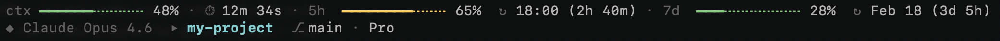
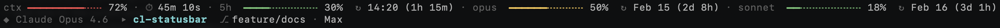
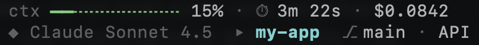

# cl-statusbar

A custom status line for [Claude Code](https://docs.anthropic.com/en/docs/claude-code) that shows model info, folder name, git branch, context usage, session duration, and Pro/Max plan rate limits — all in your terminal.

## Example output

**Pro plan:**



**Max plan:**



**API usage:**



## Features

- **Model & project info** — current model, folder name, and git branch
- **Context window** — color-coded progress bar (green → yellow → red) with window size (e.g. `200k`, `1m`)
- **Session duration** — total time for the current session
- **Pro plan limits** — 5-hour and 7-day usage bars with reset countdown
- **Max plan limits** — 5-hour bar plus per-model (Opus/Sonnet) 7-day bars
- **Extra usage** — spend/limit bar when extra usage is enabled (e.g. `$3.74/$50.00`)
- **API cost** — total USD cost when not on a Pro/Max plan
- **Usage caching** — API responses cached for 2 minutes to stay fast

## Requirements

- `jq`
- `python3`
- `curl`
- macOS (uses `security` keychain for OAuth token)

## Install

**Remote (one-liner):**
```sh
curl -fsSL https://raw.githubusercontent.com/billp/cl-statusbar/main/scripts/install.sh | bash
```

**Local:**
```sh
git clone https://github.com/billp/cl-statusbar.git
cd cl-statusbar
bash scripts/install.sh
```

Copies `statusline.sh` to `~/.claude/` and configures `settings.json` automatically.

## Uninstall

**Remote:**
```sh
curl -fsSL https://raw.githubusercontent.com/billp/cl-statusbar/main/scripts/uninstall.sh | bash
```

**Local:**
```sh
bash scripts/uninstall.sh
```

Removes `~/.claude/statusline.sh`, cleans the `statusLine` key from `settings.json` (preserving all other settings), and deletes the usage cache.

## How it works

Claude Code pipes a JSON object to the status line command on each render. The script parses it for model name, context window percentage, session duration, and working directory. It then fetches rate-limit data from the Anthropic OAuth usage API (cached to `/tmp/claude-statusline-usage.json`) and renders two lines of color-coded output.
